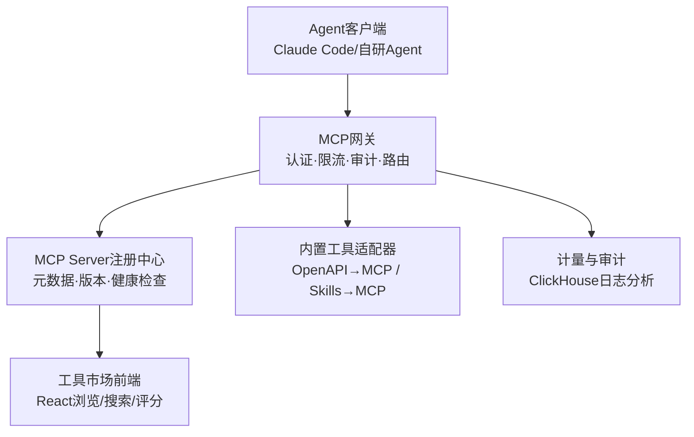

## 第一部分：选题填表

| **类别** | **编号** | **题目** | **限报** | **要求** | **需求概述** | **担任角色** | **建议方案** | **建议语言** | **成果形式** |
|:---:|:---:|:---|:---:|:---:|:---|:---|:---|:---:|:---|
| **2026年8月热点方向** | 32 | **企业级MCP工具市场与智能体网关** | 4 | | MCP（Model Context Protocol）已成为2026年Agent连接工具与数据的事实标准。构建一个企业级MCP工具市场与智能体网关：统一管理企业内部MCP Server的注册、发现、版本、权限与审计；提供工具市场页面（浏览、搜索、评分、一键接入）；网关层实现工具调用的认证鉴权、限流熔断、成本计量与全链路审计日志；支持将Skills与遗留REST API自动包装为MCP工具，解决企业“工具孤岛”与Agent治理难题。面向AI应用开发、平台工程等高需求就业方向。 | 架构师，后端，前端 | **MCP生态**：MCP Go/TypeScript SDK 1.x，Streamable HTTP传输 **网关**：Go + Gin/Echo，JWT认证、RBAC权限、Redis限流、OpenTelemetry审计链路 **市场前端**：React 19 + TypeScript，工具卡片/详情/评分/调用统计 **自动包装**：OpenAPI 3.x规范→MCP工具自动生成器；Agent Skills→MCP适配器 **存储**：PostgreSQL（注册中心元数据）+ Redis（缓存/限流）+ ClickHouse（调用日志分析） | Go + TypeScript | 系统、开发报告和部署文档 |

## 第二部分：完整设计方案与开发思路（4周版）

### 一、选题背景与价值定位

2026年，AI竞争焦点从模型能力转向Agent应用落地，而MCP是Agent接入企业系统的标准总线。企业落地Agent时普遍面临三大痛点：工具散落各处无法统一管理、Agent调用无权限与审计（合规风险）、Skills与遗留API无法复用。MCP工具市场+网关正是平台工程（Platform Engineering）与AI基础设施方向的热门岗位技能。

### 二、系统架构设计

### 三、核心功能模块

1. **注册中心**：MCP Server的注册、元数据管理（工具清单/Schema/版本）、健康检查与上下线广播。
2. **智能体网关**：统一入口代理所有MCP调用；JWT+RBAC控制“哪个Agent可调哪个工具”；Redis令牌桶限流；每次调用记录调用方、参数摘要、耗时、成本，异步写入ClickHouse。
3. **工具市场**：分类浏览（数据库/办公/研发/营销）、全文搜索、评分评论、调用量排行、一键生成接入配置片段。
4. **自动包装器**：上传OpenAPI文档自动生成MCP Server骨架代码（Go/TS双模板）；将Agent Skills规范包转换为MCP工具。
5. **审计分析**：调用量趋势、Top工具、异常调用告警（如敏感工具高频调用），输出治理周报。

### 四、开发路线图（4周）

| 阶段 | 任务 | 输出物 |
|:---|:---|:---|
| 第1周 | MCP协议研究与网关代理骨架；注册中心数据模型 | 网关可代理调用 |
| 第2周 | 认证/RBAC/限流；3个示例MCP Server（数据库、文件、HTTP） | 安全调用闭环 |
| 第3周 | 工具市场前端；OpenAPI→MCP自动包装器 | 市场可用 |
| 第4周 | 审计分析与告警；压测优化；文档与答辩 | 交付版v1.0 |

### 五、验证方案

- 网关转发开销<5ms（P99）；支持≥2000 QPS工具调用。
- 权限验证：无权限Agent调用敏感工具100%被拒并留审计记录。
- 用Claude Code或自研Agent通过网关完成“查数据库→生成报表”真实任务。

### 六、成果形式

- 网关+市场全栈源代码（含中文注释）、Docker Compose一键部署
- 3个示例MCP Server与自动包装器；压测报告与审计分析演示
- 开发报告与部署文档
